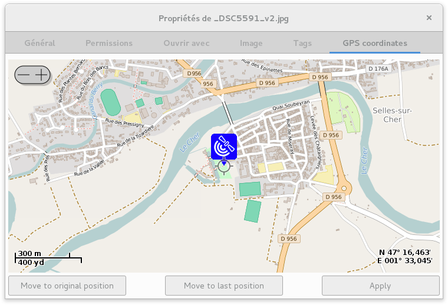

Exif GPS Property
=================

Exif GPS Property is a Nautilus extension written in Python which allows you to
modify the GPS coordinates of an image or to see the GPS coordinates of multiple
images.

It uses OpenStreetMap to display the map and Exiv2 to read and write Exif data
from/to the image.

Using Exiv2 means Exif GPS Editor can read and write any file format supported
by Exiv2 (though the preview is limited to file formats supported by GTK 3).

This means you can modify GPS coordinates for JPG, TIFF, RAW, etc.

Requirements
------------

Exif GPS Editor uses Python 2.7 and GTK 3 / Gnome 3.

The following libraries must be installed:

- gir1.2-osmgpsmap-1.0
- python-gi-cairo
- gir1.2-gexiv2-0.10
- python-nautilus

Under Debian 8 (Jessie), these libraries can be installed with:

.. code:: shell

    apt-get install gir1.2-osmgpsmap-1.0 python-gi-cairo gir1.2-gexiv2-0.10 python-nautilus

Installation
------------

The Python script exifgpsproperty.py must be copied in one of the following
directories:

- ~/.local/share/nautilus-python/extensions
- /usr/share/nautilus-python/extensions

No other file is needed! exifgpsproperty.py is a self contained application.

Once the script is ready, you need to restart Nautilus:

.. code:: shell

    killall nautilus

